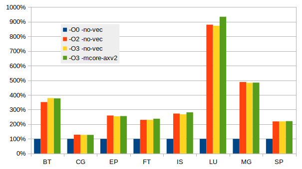
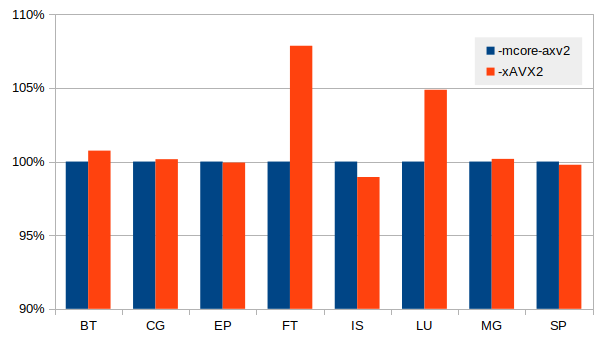
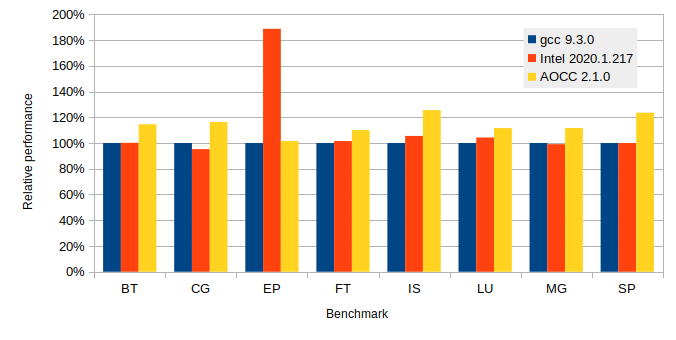

# Building scientific software

## Introduction
This is just a quick short guide on the topic. For more in depth documentation please
check out the PRACE Best Practice Guides at:
https://prace-ri.eu/training-support/best-practice-guides/

Most relevant for Betzy :
https://prace-ri.eu/training-support/best-practice-guides/best-practice-guide-amd-epyc/
and an update covering AMD Rome named  "Best Practice Guide Modern Processors"
soon to be published.


## Compilers

### Intel
#### Introduction
The Intel compiler suite is supported on all Sigma2 systems. On the
systems Saga and Fram the processors are from Intel while the
processors on Betzy are from AMD. As the Intel compiler is primarily
compiler written fro the Intel processors there are some minor issues
when using it to build core for the AMD processors.


#### Documentation
The documentation of the Intel compiler are found at
[Intel compiler](https://software.intel.com/content/www/us/en/develop/tools/compilers.html)
The web site is comprehensive and some browsing are required to find the needed documents.
Most users want to review the reference manual.
+ [C/C++ reference](https://software.intel.com/content/www/us/en/develop/documentation/cpp-compiler-developer-guide-and-reference/top.html)
+ [Fortran reference](https://software.intel.com/content/www/us/en/develop/tools/compilers/fortran-compilers/documentation.html)


#### Compiler flags
The single most common question requested is a set of suggested
compiler flags. The Intel development team have already selected a
very good set of flags and just a simple *-O3* flag will provide quite
good choice. The compiler comes with a set of default optimisation flags already
set. Just invoking the compiler without any such flags will generate reasonbly good code. 

The flag for OpenMP is very often needed : *-qopenmp* and must be used in both compiling a linking.

To ask the compiler generate optimised code have a huge impact in performance. 
The following graph show the observed speed using the 
[NASA NPB MPI](https://en.wikipedia.org/wiki/NAS_Parallel_Benchmarks) benchmarks built 
using the Intel compiler and run using OpenMPI at 64 ranks.



The benefit of selecting optimisation flags is obvious. The effect of vectorisation is 
less pronounced with these benchmarks which are extracts from real applications and running with datasets of 
serious size. The compiler can recognise some type of code and generate excellent code, often related 
to cache and TLB issues. Just looking at the generated code will not tell what the compiler actually did. 
See an extreme case with matrix multiplication below. Tuning tools can help looking for cache and 
[TLB](https://en.wikipedia.org/wiki/Translation_lookaside_buffer) issues.

Some optimisation flags are a bit more tricky. As all processors
support AVX2 this can always be used. A suggested list set of flags
than be tried might include:
* -O3
* -O3 -xHost
* -Ofast
* -O3 -march=core-avx
* -O3 -xavx
* -O3 -xavx2
* -O3 -xcore-avx2

The flags above have been tested and yield good results. On Betzy the
flags involving *-xavx*, *-xavx2* and *-xcore-avx2* can cause
problems. As the -x prefix implies it will only generate code for a
processor supporting AVX and AVX2. Intel has implemented a run time
processor check for any program compiled with these flags, which will result
in a message like this:

    Please verify that both the operating system and the processor support
    Intel(R) X87, CMOV, MMX, FXSAVE, SSE, SSE2, SSE3, SSSE3, SSE4_1, SSE4_2,
    MOVBE, POPCNT, AVX, F16C, FMA, BMI, LZCNT and AVX2 instructions.

This only apply to the main routine.  If the main() function is not compiled
with ``-xavx``/``-xavx2`` flags the test is not inserted and performance
is as expected.

| Vectorisation flag    | Single core performance |
|:---------------------:|:-----------------------:|
| -O3                   |  4.33 Gflops/sec        |
| -O3 -march=core-avx2  |  4.79 Gflops/sec        |
| -O3 -xavx             | 17.97 Gflops/sec        |
| -O3 -xavx2            | 26.39 Gflops/sec        |
| -O3 -xcore-avx2       | 26.38 Gflops/sec        |

```{warning}
The ``-xavx2`` flag is quite intrusive, it's building only AVX2 vector
instructions and if the processor does not support it, you'll get illegal
instruction.
```
The example above is a best case where the Intel compiler manage to analyse 
the code and apply special optimisation for matrix multiplication. Checking the 
code show that is does not call external functions like the matmul in MKL.

For codes that are more realistic and closer to scientific codes like the NPB benchmarks the effect 
is much smaller. In some cases there are still a significant gain by using the ``-xAVX2``, the figure 
below illustrate this.



There are a large range of other flags, and while the web
documentation is very good it can be overwhelming. A simple trick is
to issue the following command `icc -help > icc.hpl` and open the file
in an editor and search and read relevant paragraphs. Except from
language specific flags most of the flags are similar for C/C++ and
Fortran.

The flags related to optimisation reports can be useful, *-qopt-report*.
To generate a nice optimisation report some of the following flags could
be used.

* -qopt-report-help
* -qopt-report=1 (any number from 1 through 5 are valid, 0 turn it off)
* -qopt-report-file=<file.opt.txt>
* -qopt-report-annotate

An example is : `-qopt-report=5 -O3 -xavx2 -g -S` which will generate
a comprehensive report and a file containing the generated
code. Reviewing this report and the code can be of great help in cases
where the compiler fail to optimise as expected.


### GNU
#### Introduction
GNU compilers are an integral part of the Linux distribution. However,
the versions of the compilers that comes with the distribution are
generally not the newest version. Look for modules that supply a more
recent version. The compiles support C/C++ and Fortran.

#### Documentation
The compilers have good man pages covering most of what is commonly needed. More deep
documentation is found here : https://gcc.gnu.org/onlinedocs/ .


#### Compiler flags
The default settings of gcc/gfortran are not optimal for performance. A set of optimising flags are needed. The flag for OpenMP is *-fopenmp*.

There a lot of optimisers available, a list can be generated using the command
`gcc --help=optimizers`

Some set of flags for optimisation include :
* -O2 (often use for only memory intensive applications)
* -O3
* -O3 -mfma -mavx2
* -O3 -march=znver2 -mtune=znver2 (for AMD)
* -O3 -march=skylake-avx512  (for Intel Skylake)


### AMD AOCC/llvm
#### Introduction
AMD support the development of compilers based on llvm. The Software development kit can be found at : https://developer.amd.com/tools-and-sdks/ .
C/C++ and Fortran are supported.

#### Documentation
The AMD documentation is limited. Documentation can be found at the AMD developer
web site given above.

#### Compiler flags
The llvm compiler show a huge range of compiler flags, the AMD
documentation provide a nice subset of relevant flags. The flag for
OpenMP is *-fopenmp*. A suggested flags to try is given below.
* -O3
* -Ofast
* -Ofast -march=znver2 -mtune=znver2  (for AMD)
* -Ofast -march=znver2 -mavx2 -m3dnow (for AMD)


### PGI
#### Introduction
Portland Group compiler, known as PGI compiler is now a part of NVIDIA. The PGI web page
is still available : https://www.pgroup.com/index.htm .

#### Documentation
Documentation can be found at : https://www.pgroup.com/resources/docs/20.4/x86/index.htm

#### Compiler flags
Please review the documentation for an updated list of the suggested compiler flags.

A set of suggested flags are :
* -O3 -tp zen -Mvect=simd -Mcache_align -Mprefetch -Munroll  (for AMD)


### Performance of compilers
A test using the well known reference implementation of matrix matrix
([dgemm](http://www.netlib.org/lapack/explore-html/d7/d2b/dgemm_8f_source.html))
multiplication is used for a simple test of the different compilers.

| Compiler      | Flags                               | Performance       |
|:--------------|:-----------------------------------:|:-----------------:|
| GNU gfortran  | -O3 -march=znver2 -mtune=znver2     | 4.79 Gflops/s     |
| AOCC flang    | -Ofast -march=znver2 -mavx2 -m3dnow | 5.21 Gflops/s     |
| Intel ifort   | -O3 -xavx2                          | 26.39 Gflops/s    |

The Intel Fortran compiler do a remarkable job with this nested loop problem.
As we have seen above the matrix matrix multiplication is a special case. For more 
realistic examples the performace is more comparable.



It turns out that for the EP benchmark (Generate independent Gaussian random variates using the Marsaglia polar method) 
the Intel compiler manage to do something smart. 

## Performance libraries

### Intel MKL
#### Introduction
The Intel Math Kernel Library comes with the compiler suite and is well known as
high performance library. It comes in both sequential and multi threaded functions
and is know for its very high performance.

MKL have wrappers for FFTW so no rewrite is needed to link any applications using
FFTW with MKL. Both Include files and library functions are provided.

When using the Intel compiler the compiling and linking is very simple, most
of the times is enough to just add *-mkl*. Adding *=sequential* or *=parallel*.

When using MKL with the GNU compilers some more work is often needed.
An example can provide some hints:
`-L$MKLROOT/lib/intel64 -lmkl_gnu_thread -lmkl_avx2 -lmkl_core -lmkl_rt`
The variable *MKLROOT* is set when the Intel module is loaded.

The following command can be of help when encounter missing symbols:
`nm -A $MKLROOT/lib/intel64/* | grep <missing symbol>`
Look for symbols with *T* (T means text,global - e.g. it's available, U means undefined).


#### Forcing MKL to use best performing routines
MKL issue a run time test to check for genuine Intel processor. If this test fail it will select a generic x86-64 set of routines yielding 
inferior performance. This is well documented in [Wikipedia](https://en.wikipedia.org/wiki/Math_Kernel_Library) and remedies in 
[Intel MKL on AMD Zen](https://danieldk.eu/Posts/2020-08-31-MKL-Zen.html).

Research have discovered that MKL call a function called *mkl_serv_intel_cpu_true()* to check the current CPU. If a genuine Intel processor is 
found it simply return 1. The solution is simply to override this function by writing a dummy functions which always return 1 and place this 
early in the search path. The function is simply:
```c:
int mkl_serv_intel_cpu_true() {
  return 1;
}
```
Compiling this file into a shared library using the following command:
`gcc -shared -fPIC -o libfakeintel.so fakeintel.c`

To put the new shared library first in the search path we can use a preload environment variable:
`export LD_PRELOAD=<path to lib>`
A suggestion is to place the new shared library in `$HOME/lib64` and using 
`export LD_PRELOAD=$HOME/lib64/libfakeintel.so` to insert the fake test function.

In addition the envionment variable *MKL_ENABLE_INSTRUCTIONS* can also have a significant effect. 
Setting the variable to AVX2 is adviced. Just changing it to AVX have a significant negative impact. 
  
For performance impact and more about running software with MKL please see
{ref}`running-scientific-software`.


#### Documentation
Online documentation can be found at :  https://software.intel.com/content/www/us/en/develop/documentation/mkl-linux-developer-guide/top.html

There is a link line helper available : https://software.intel.com/content/www/us/en/develop/articles/intel-mkl-link-line-advisor.html , this can often be of help.


### AMD AOCL
#### Introduction
The AMD performance library provide a set of library functions optimised for the AMD processor.
The web page is : https://developer.amd.com/amd-aocl/ .

#### Documentation
Documentation can be found at https://developer.amd.com/amd-aocl/ .


### Performance
Using the MLK library with AMD is straightforward. 

In order to get MKL to select the correct AVX2 enabled routine a flag 
need to be set, use : `export MKL_DEBUG_CPU_TYPE=5`. However, this flag 
is no longer used in the 2020 version of the MKL. For this newer version 
a different workaround is needed.

For more about MKL performance and AMD see above about 
"Forcing MKL to use best performing routines", where usage of a cheating 
library is explained. 


The well known top500 test HPL is using linear algebra library functions, 
the following performance data were obtained using a single node.

| Library        | Environment flag             |Performance    |
|:---------------|:-----------------------------|:-------------:|
| AMD BLIS-mt    | none                         | 3.14 Tflops/s |
| MKL-2019.5.281 | none                         | 1.71 Tflops/s |
| MKL-2019.5.281 | MKL_DEBUG_CPU_TYPE=5         | 3.23 Tflops/s | 
| MKL-2020.4.304 | none                         | 2.54 Tflops/s |
| MLL-2020.4.304 | MKL_DEBUG_CPU_TYPE=5         | 2.54 Tflops/s |
| MKL-2020.4.304 | MKL_ENABLE_INSTRUCTIONS=AVX2 | 2.54 Tflops/s |
| MKL-2020.4.304 | LD_PRELOAD=./libfakeintel.so | 3.23 Tflops/s |

  
The test below using matrix matrix multiplication, Level 3 BLAS
function dgemm is used to test single core performance of the
libraries. The tests are run on a single node using a single core on
Betzy.

| Library | Link line                                                   | Performance     |
|:--------|:-----------------------------------------------------------:|:---------------:|
| AOCL    | `gfortran -o dgemm-test.x -O3 dgemm-test.f90 -L$LIB -lblis` | 50.13 Gflops/s  |
| AOCL    | `flang -o dgemm-test.x -O3 dgemm-test.f90 -L$LIB -lblis`    | 50.13 Gflops/s  |
| MKL     | `ifort -o dgemm-test.x -O3 dgemm-test.f90 -mkl=sequential`  | 51.53 Gflops/s  |

At 50 Gflops/s per core the aggregate number is 6.4 Tflops/s quite a
bit more than what's expected from these nodes. This is a nice example
of clock boost when using only a few cores, or in this case only one.

While linear algebra is widely used Fourier Transform is also heavily used.
The performance data below is obtained for a 3d-complex forward FT with a footprint
of about 22 GiB using a single core.

| Library        | Environment flag             |Performance |
|:---------------|:-----------------------------|:----------:|
| FFTW 3.3.8     | none                         | 62.7 sec.  |
| AMD/AOCL 2.1   | none                         | 61.3 sec.  |
| MKL-2020.4.304 | none                         | 52.8 sec.  |
| MKL-2020.4.304 | LD_PRELOAD=./libfakeintel.so | 27.0 sec.  |
| MKL-2020.4.304 | LD_PRELOAD=./libfakeintel.so |            |
|                | MKL_ENABLE_INSTRUCTIONS=AVX  | 40.5 sec.  |
| MKL-2020.4.304 | LD_PRELOAD=./libfakeintel.so |            |
|                | MKL_ENABLE_INSTRUCTIONS=AVX2 | 27.0 sec.  |

With the 2020 version of MKL the instruction set variable has a significant effect.

The performance of MKL is significantly higher than both FFTW and the AMD library. 

For applications spending a lot of time executing library function code a review of
libraries used and some testing using the specific library functions actually used. 
Not all library functions are implemented equally good by the authors. 


## MPI libraries

### OpenMPI
#### Introduction
The OpenMPI library are based on the old LAM MPI from Ohio
Supercomputing Center. This one of the most widely used MPI
implementations today. The web site is : https://www.open-mpi.org/ .

OpenMPI is supported on all the Sigma2 systems, with versions for both
GNU and Intel compilers, and in some cases some support for other
compilers.

#### Usage
The compiler wrappers hiding the include and link environment are called:
* mpicc for C
* mpicxx for C++
* mpif90 for Fortran
* mpff77 for Fortran

In practice both mpif90 and mpif77 points to the same Fortran compiler. A quick check for
compiler versions is `mpif90 -v`.

Compiler flags are propagated to the underlaying compiler.

To run programs the launched application mpirun is used (SLURM srun is
an option also). There are a range of options to OpenMPI's mpirun of
which `--bind-to` and `--map-by` a the most important when running on
the Sigma2 systems using SLURM as the queue system set the number of
ranks and other run time parameters like list of hosts etc. This is normal
for MPI libraries built and installed with SLURM support.


### Intel MPI
#### Introduction
The Intel MPI is part of the Intel compiler suite and is a widely used MPI implementation.
More information is found on-line at : https://software.intel.com/content/www/us/en/develop/tools/mpi-library.html .

Intel MPI is supported on all Sigma2 systems, but mostly for use with
the Intel compiler, it can however, to some extent be used with
GNU. The support is present.

#### Usage
The compiler wrappers have different naming then many other MPI implementations.
* mpiicc for C
* mpiicpc for C++
* mpiifort for Fortran
* mpicc  GNU C
* mpigcc GNU C
* mpicxx GNU C++
* mpifc GNU Fortran

There are a lot of environment variables to be used with Intel MPI, they all start with *I_MPI*
* I_MPI_PIN
* I_MPI_PIN_DOMAIN
* I_MPI_PIN_PROCESSOR_EXCLUDE_LIST

The variable *I_MPI_PIN_DOMAIN* is good when running hybrid codes,
setting it to the number of threads per rank will help the launcher to
place the ranks correct.
Setting *I_MPI_PIN_PROCESSOR_EXCLUDE_LIST=128-255* will make sure only
physical cores 0-127 are used for MPI ranks. This ensures that no two
ranks share the same physical core.

As with any of these variable and other please review the
documentation pointed to above and do some testing yourself before
employing in large production scale.

Running applications with Intel MPI is just like a simple as for
OpenMPI as Intel MPI also has support for SLURM. Just `mpirun ./a.out`
is normally enough.
