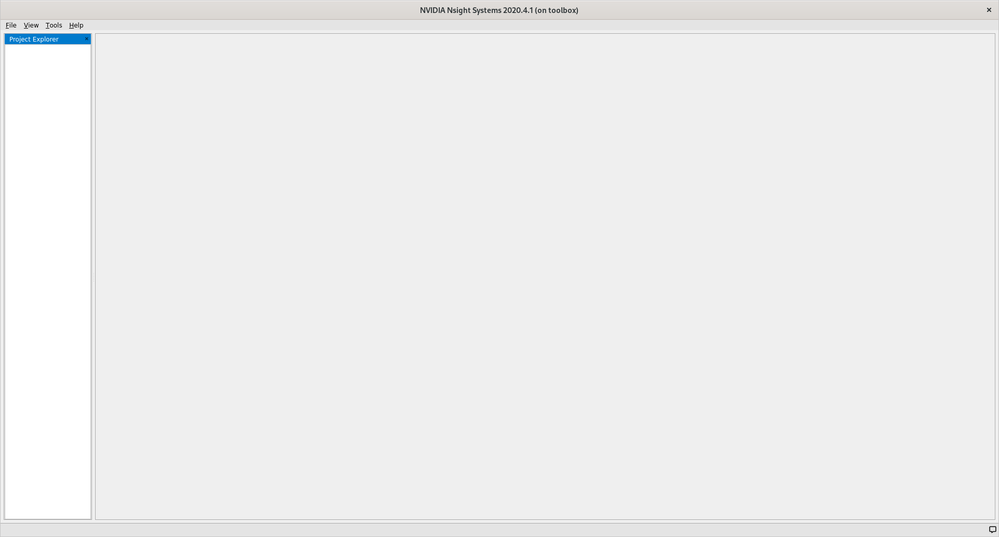
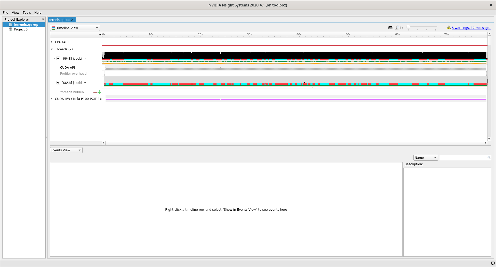
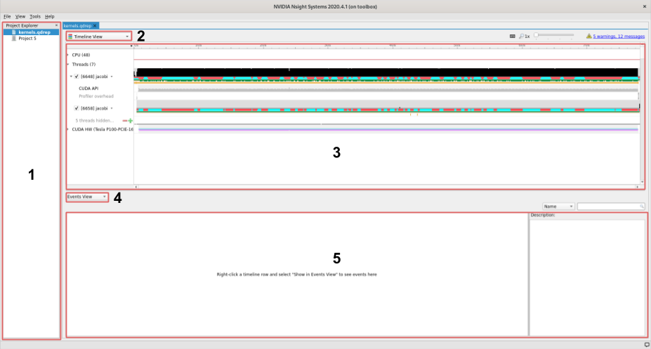
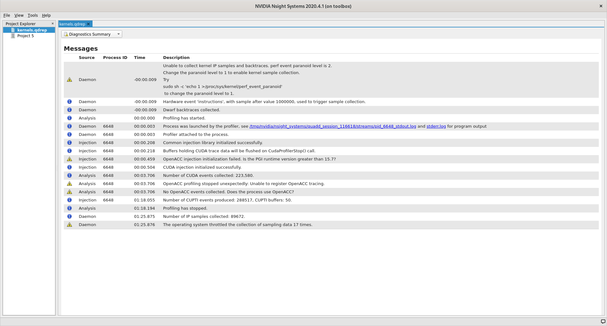
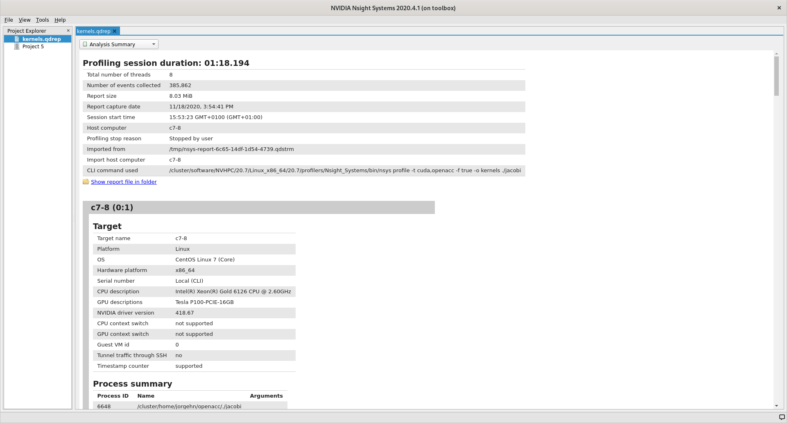

```{index} GPU; Getting started with OpenACC and Nvidia Nsight, OpenACC; Getting started with OpenACC and Nvidia Nsight, Nvidia Nsight; Getting started with OpenACC and Nvidia Nsight
```

(openacc)=

# Getting started with OpenACC and Nvidia Nsight
> OpenACC is a user-driven directive-based performance-portable parallel
> programming model.
From the [OpenACC homepage](https://www.openacc.org).

In many ways OpenACC is similar to OpenMP, but with a focus on running the code
on accelerators (such as GPUs). OpenACC defines a set of directives (for both
`C/C++` and `Fortran`) that can be included in existing code to transition the
runtime to accelerators.

Accelerators, like the Nvidia GPUs on Saga, are great for numerical calculations
and applications that work on the "SIMD" - **S**ingle **I**nstruction
**M**ultiple **D**ata principle, (where one or more operations are applied to a
large number of datapoints independently of each other). Examples include
operations like
[`gemm`](https://en.wikipedia.org/wiki/Basic_Linear_Algebra_Subprograms#Level_3)
which can be [**6 times** faster than on the
CPU](http://developer.download.nvidia.com/compute/cuda/6_5/rel/docs/CUDA_6.5_Performance_Report.pdf),
or generating random numbers which can be [**70 times**
faster!](http://developer.download.nvidia.com/compute/cuda/6_5/rel/docs/CUDA_6.5_Performance_Report.pdf)

```{note}
If you know some OpenACC or want to see tips for larger applications take a look
at {ref}`the tip section <tips>` at the bottom.
```

```{note}
We have also included a Fortran example at
{ref}`the end of this document <fortran>`.
```

```{tip}
For a summary of available directives we have used [this reference
guide.](https://www.openacc.org/sites/default/files/inline-files/API%20Guide%202.7.pdf)
```

## Introduction
This guide will introduce the concept of OpenACC directives in `C/C++` code, how
to compile and run such programs on {ref}`saga` and how to
use [Nvidia Nsight](https://developer.nvidia.com/nsight-systems) to profile and
optimize code.

After reading this guide you should:
- Know what OpenACC is
- Know how to compile `C/C++` OpenACC programs on Saga
- Know how to run OpenACC programs on GPUs on Saga
- Know how to run OpenACC programs with a profiler (`nsys`) on Saga
- Know how to understand the basic Nsight user interface
- Know how to optimize OpenACC programs based on profiler results

## OpenACC
To begin we will need an example program that does some calculations that we
would like to speed up.

We have selected an example based on heat dissipation utilizing Jacobi
iterations. The initial source can be found in `jacobi_serial.c`, shown below:

```{eval-rst}
.. literalinclude:: openacc/jacobi_serial.c
   :language: c
```
```{eval-rst}
:download:`jacobi_serial.c <./openacc/jacobi_serial.c>`
```

### Compiling and running on Saga
To compile this initial version on Saga we will need to load the [`Nvidia HPC
SDK`](https://developer.nvidia.com/hpc-sdk). This can be done with the following
command:

```bash
$ module load NVHPC/20.7
```

```{note}
You can check if a newer version of `NVHPC` is available by issuing the command
`module avail NVHPC`
```

Then to compile or serial version we will invoke the `nvc` compiler with the
following command:

```bash
$ nvc -g -fast -o jacobi jacobi_serial.c
```

We can run this program on a compute node by issuing the following:

```bash
# Run on compute node with 512MB of memory for a maximum of 2 minutes
$ srun --account=<your project number> --time=02:00 --mem-per-cpu=512M time ./jacobi
# The first number outputted should be the number of seconds it took to run the
# program:
# 40.79user 0.01system 0:40.91elapsed 99%CPU (0avgtext+0avgdata 35212maxresident)k
# 5144inputs+0outputs (18major+1174minor)pagefaults 0swaps
```

### Initial transition
To begin transitioning the code to run on a GPU we will insert the `kernels`
directive into the code. The `kernels` directive tells OpenACC that we would
like everything inside the directive to be run on the GPU, but it is up to the
compiler to decide how to best do this.

It is always a good idea to begin with the `kernels` directive as that is the
easiest and it gives the compiler a lot of flexibility when translating the
code. `kernels` is also a good way to understand if the compiler is not able to
optimize something and if we need to rewrite some code to better run on the GPU.

The code is available in `jacobi_kernels.c` and the changes applied are shown
below.

```{eval-rst}
.. literalinclude:: openacc/jacobi_kernels.c
   :language: c
   :lines: 36-58
   :emphasize-lines: 3,4,21
```
```{eval-rst}
:download:`jacobi_kernels.c <./openacc/jacobi_kernels.c>`
```

As can be seen in the code above we have added the `kernels` directive around
the main computation that we would like to accelerate.

To compile the above we need to tell `nvc` that we would like to accelerate it
on GPUs. This can be done with the `-acc` flag. We will also add the
`-Minfo=accel` flag which informs the compiler that we would like it to inform
us of what it is doing with accelerated regions. The full command is as follows.

```bash
$ nvc -g -fast -acc -Minfo=accel -o jacobi jacobi_kernels.c
```

When running this command pay special attention to the information it is telling
us about the accelerated region.

```bash
main:                                                                                 
     40, Generating implicit copyin(array[:][:]) [if not already present]             
         Generating implicit copyout(array[1:1998][1:1998]) [if not already present]  
         Generating implicit copy(error) [if not already present]                     
         Generating implicit copyout(arr_new[1:1998][1:1998]) [if not already present]
     42, Loop is parallelizable                                                       
     43, Loop is parallelizable                                                       
         Generating Tesla code                                                        
         42, #pragma acc loop gang, vector(4) /* blockIdx.y threadIdx.y */            
             Generating implicit reduction(max:error)                                 
         43, #pragma acc loop gang, vector(32) /* blockIdx.x threadIdx.x */           
     52, Loop is parallelizable                                                       
     53, Loop is parallelizable                                                       
         Generating Tesla code                                                        
         52, #pragma acc loop gang, vector(4) /* blockIdx.y threadIdx.y */            
         53, #pragma acc loop gang, vector(32) /* blockIdx.x threadIdx.x */           
```

In the above output the numbers corresponds to line numbers in our
`jacobi_kernels.c` source file and the comments show what `nvc` intends to do
with each line.

Before we start profiling to see what we can optimize, lets run the program to
learn the additional `Slurm` parameters needed for running with GPU on Saga. The
following is the new command needed (notice the added `--partition=accel` and
`--gpus=1` flags)

```bash
$ srun --account=<your project number> --time=02:00 --mem-per-cpu=512M --partition=accel --gpus=1 time ./jacobi
```

`--partition=accel` is needed to tell `Slurm` to only run on nodes on Saga with
GPUs and the `--gpus=N` line tells `Slurm` that we would like to have access
to `N` GPUs (`accel` nodes on Saga have `4` separate GPUs, above we are asking
for only one GPU).

### Profiling
To profile the `kernels` version of our program we will here transition to
{ref}`job-scripts`. This will make it a bit easier to
make changes to how the program is run and also makes it a bit more
reproducible.

The `Slurm` script is available as `kernels.job` and is show below.

```{eval-rst}
.. literalinclude:: openacc/kernels.job
   :language: bash
```
```{eval-rst}
:download:`kernels.job <./openacc/kernels.job>`
```

Run this script by issuing

```bash
$ sbatch kernels.job
```

The end result should be a file called `kernels.qdrep` which contains the
profiling information. Download this file to your local computer to continue
with this guide.

```{eval-rst}
:download:`kernels.qdrep <./openacc/kernels.qdrep>`
```

## Nsight
We will continue this guide `kernels.qdrep` as the profiling result to view.

```{note}
To view images in a larger format, right click and select `View Image`
```

To begin, start [Nsight Systems](https://developer.nvidia.com/nsight-systems) on
your own machine, giving the following view.



To open our profiling result click `File`, then `Open` and navigate to the
folder where you stored `kernels.qdrep`. Loading this file should give you the
following view.



### User interface
The user interface of Nsight is comprised of three main areas and two drop down
menus that control what is shown in the different areas.



1. On the left we find the project area, this list shows your project and
   profiles that you have loaded.
2. The left topmost dropdown menu selects which view to show
3. In the middle of the user interface we find the main view, currently showing
   the timeline of our profile. This view changes depending on the choice made
   in the dropdown menu marked with a `2`.
4. The second dropdown, in the middle of the screen, selects different views for
   the bottommost area.
5. The area at the bottom shows additional information about the profile
   together with the timeline view.

### Views
Using the topmost dropdown menu, marked with `2` in the picture above, we can
select different views for the current profile.

When first opening a new profile it can be informative to start with the
`Diagnostics Summary`. This view shows a summary of the profile and can give
great hints about what went wrong if the profile is not as expected.



After that the `Analysis Summary` give an overview of the profile. This view
contains a lot of information which can be nice to review to ensure that the
profile was configured correctly. Instances of good places to review are the
`CLI command used` which shows how the profile was generated, `GPU info` which
shows the accelerator in use and the `Analysis options` which show how `nsys`
interpreted the command line arguments.



The last view that we will detail here (because the two remaining are not that
informative for understanding the profile information) is the `Timeline View`,
which is the default view that we saw when we opened Nsight.

A good place to start with this view is the second dropdown, marked with `4`. In
this dropdown we can select additional information to display about our profile
results. By selecting one of the different `... View` options the profiler can
show us which functions used what amount of the runtime in different ways. In
the image below we have selected `Bottom-Up View` which sorts functions by
placing the most time consuming ones at the top.


In the timeline main view, we can see the usage of different APIs and the amount
of CPU and GPU usage. A quick first thing to do is to click the arrow next to
our GPU name so that it shows the percentage of `Kernels` usage and the
percentage of `Memory` usage. In our current profile we can see that we are only
using about `6%` of the `Kernels` resource which means that our GPU is spending
only `6%` of its time actually doing useful compute.


To better understand what we are seeing in the timeline it is useful to zoom
into specific areas to see what is going on. Use the mouse cursor to select a
small column of the timeline area, right click and select `Zoom into selection`.
Depending on how long the profile ran for it can be necessary doing this several
times. Below we have tried to illustrate how far we would usually zoom in.


In the last picture above we have zoomed in on what appears to be a cycle of two
kernel launches. Remembering our code, that is most likely two iterations of the
`while` loop where we placed our `kernels` directive inside.

## Profile Guided Optimization
Even though we have translated our program to run on the GPU it has not yet
given us the results that we were after. Running on GPU resulted in a
computation that is about `1.5` times slower than just running on CPU, but we
can do better.

Looking at the zoomed in view of the timeline, in the image below, we can see
that most of the time is taken up with transferring data between the CPU and the
GPU.


Optimizing data transfer is a crucial part of translating code to the GPU and
accounts for most of the time spent optimizing a program for the GPU.

Looking at our `while` loop we can see that we are only interested in the final
result after the loop exits which means that we should try to keep the data on
the GPU and only transfer in and out at the beginning and end of the loop. To do
this we will introduce the `#pragma acc data` clause which tells the compiler
that we only want to do data movement for a given scope. The changes needed
center around the `while` loop shown below.

```{eval-rst}
.. literalinclude:: openacc/jacobi_data.c
   :language: c
   :lines: 36-59
   :emphasize-lines: 1
```
```{eval-rst}
:download:`jacobi_data.c <./openacc/jacobi_data.c>`
```

Let us compile this on Saga and see if this results in better performance.
Compile and run with the following commands.

```bash
# Remember 'module load NVHPC/20.7' when logging in and out
$ nvc -g -fast -acc -Minfo=accel -o jacobi jacobi_data.c
$ sbatch kernels.job
```

Below we have included the timeline view of the updated
profile.

```{eval-rst}
:download:`data.qdrep <./openacc/data.qdrep>`
```


Although this doesn't look all that different from the previous profiles, notice
that the timeline only goes to about `3.6` seconds, the previous profile went to
above `70` seconds. Almost a `20x` speedup! Compared to our runs on the CPU this
translation to the GPU has given us about a `10x` speedup. This shows the
importance of data movement and is a good illustration of the optimization
process, initially the code ran much slower on the GPU than on the CPU before
becoming better than the CPU.

---

Doing better than this will be difficult, however, to introduce a few more
concept that can be nice - we will perform a few more iterations on the code.
However, do not expect great improvements.

The first improvement that we can do is to realize that `arr_new` will never be
needed and is simply a scratch array for our computation, we can thus change our
data directive to `#pragma acc data copy(array) create(arr_new)`. This tells the
compiler that it should copy `array` from the CPU to the GPU when entering the
loop and copy the data back from the GPU to CPU when exiting the scope. The
`create(arr_new)` tells the compiler to only create the data on the GPU, it will
not copy anything in or out, which is ok for us since we will overwrite it on
first loop anyway and never use it after the loop.

The above optimization will net us very little so lets do some more. Instead of
using the `kernels` directive we can take more control of the translation and
tell the compiler that we would like to parallelize both loops. This is done
with the `#pragma acc parallel loop` directive. Since we also want to do a
reduction across all loops we can also add a reduction by writing `#pragma acc
parallel loop reduction(max:error)` to the first loop. Lastly, we will apply the
`collapse(n)` clause to both loop directives so that the compiler can combine
the two loops into one large one, with the effect of exposing more parallelism
for the GPU. The new code is show below.

```{eval-rst}
.. literalinclude:: openacc/jacobi_optimized.c
   :language: c
   :lines: 36-56
   :emphasize-lines: 1, 4, 14
```

```{eval-rst}
:download:`jacobi_optimized.c <./openacc/jacobi_optimized.c>`
```

Looking at the generated profile, `optimized.qdrep` shown below, we can see that
we managed to eek out slightly more performance, but not that much.

```{eval-rst}
:download:`optimized.qdrep <./openacc/optimized.qdrep>`
```


Compared to the initial translation we can see now that the ratio of `Kernels`
to `Memory` on the GPU is much better, `98%` spent actually doing useful
compute.

If we zoom in, as in the image below, we can see that there is not much wasted
time between useful compute. Going further with OpenACC is most likely not that
useful and getting this to run even quicker will likely require a rewrite to
`CUDA` which is outside the scope and intention of this guide.


One way to see how well we have optimized the code is to look at the white space
between compute regions. In our initial translation these white spaces lasted
for around `4` milliseconds. In the optimized profile the whitespace between
kernels amount to around `32` **microseconds**.

## Summary
In this guide we have shown how to use OpenACC to transition a simple `C`
example from running on the CPU to running the main calculations on GPU. We have
detailed how such code can be used, compiled and run on Saga. And, we have
introduced Nsight and how it can be used to profile and guide OpenACC
transitions.

(tips)=
## Tips
- **Do not expect miracles!** Translating a large code base to run on GPU is a
    large undertaking and should not be taken lightly. Just getting a large code
    base to run on GPU and having almost the same performance as the CPU code is
    extremely good! Optimizing for GPUs require time and patience.
- Always start with the `kernels` directive and study the compiler output. This
    should guide your next steps. The information outputted by the compile will
    usually tell you if the scope of the directive can be run effectively on GPU
    and if you should take some steps to rewrite parts of the code.

    Compiler output like `Loop carried dependence of <name> prevents
    parallelization` and `Loop carried backward dependence of <name> prevents
    vectorization` are clear indications that the compiler is not able to
    automatically translate the code and a rewrite might be necessary.
- Data movement is paramount. If you know some data is only needed to read from
    use `copyin`, `copyout` if it is only written to, `present` can be nice if
    you know the data should already be present on the GPU and `copy` ensures
    that the program functions as expected. OpenACC has several directive that
    can be used to perform data management and some are even scoped for the
    entire program.
- Be structured in your approach. Only translate one scope at a time. This
    ensures that you can focus on a small area and get less compiler output to
    study. Profiling between each round may not be necessary, but it can be
    valuable to know what is happening.

(fortran)=
## Fortran
As mentioned in the beginning of this document, OpenACC also supports `Fortran`.
Directives in Fortran can be added in a similar fashion to OpenMP directives,
with `!$acc` instead of `!$OMP`. Below is an example of matrix multiplication
with the `!$acc kernels` directive.

```{eval-rst}
.. literalinclude:: openacc/mxm.f90
   :language: fortran
   :emphasize-lines: 12, 20
```
```{eval-rst}
:download:`mxm.f90 <./openacc/mxm.f90>`
```

On Saga, load the `NVHPC/20.7` module and compile with `nvfortran` as follows:
```bash
$ module load NVHPC/20.7
$ nvfortran -o mxm -fast -acc -gpu=cc60 -Minfo=accel mxm.f90
```

To run the program on Saga with GPUs use:
```bash
$ srun --account=<your project number> --time=02:00 --mem-per-cpu=512M --partition=accel --gpus=1 ./mxm
```

This program is as close to the best case scenario possible for accelerators
and, on Saga, gives a speedup of `24x` compared to a single CPU core.

| Flags                    | Run time      | Speedup  |
|:------------------------:|:-------------:|:--------:|
| `-fast` (single CPU core)| 48.9 seconds  |   1 x    |
| `-fast -acc -gpu=cc60`   | 2.0 seconds   |  24 x    |

You can profile `Fortran` programs in the same way you would for `C/C++`, using
`nsys profile` and the flag `-t cuda,openacc`.
