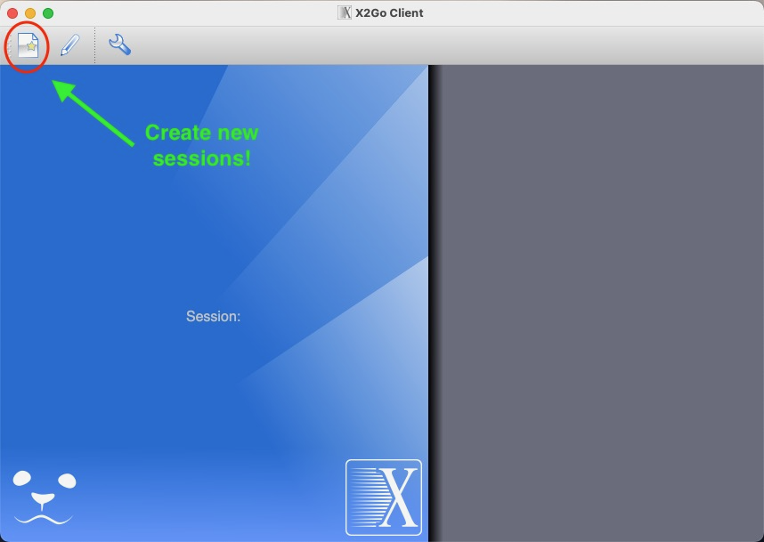

(remote-desktop)=

# Remote desktop

```{contents} Table of Contents
```

## Introduction

The remote desktop service makes it possible to run graphical applications on the Fram and Saga systems with reasonable performance over the network. Currently (Jan. 2023) the login-system has no hardware acceleration so running advanced 3D rendering applications will probably not have adequate performance.

Currently, we do support and maintain two parallell solutions for remote desktop on Fram, and only one on Saga (TigerVNC). Both solutions require users to install a client application on her/his computer in order to be able to access the solution. The recommended solution currently is X2Go - <https://wiki.x2go.org/doku.php/doc:newtox2go>

## [X2Go](https://wiki.x2go.org/doku.php/start)


X2Go is an application that enables you to do remote visualization on Fram and Saga. It works as a Remote Desktop Protocol on top of NX/X11. X2Go Client requires a local X11 server to display the remote sessions. 
The server you use depends on your local operating system, as follows:

* Windows systems: an X11 server is provided with X2Go client.
* Linux systems: the client component of X2Go uses the local Xorg server.
* Mac OS X systems: you must install the XQuartz X11 server as an extra component.


### How to use the service on NRIS machines

*X2Go Server* is currently installed on `login-2.fram.sigma2.no` and `login-3.fram.sigma2.no`, and you need to log in directly to these nodes to use X2Go. 

***To install X2Go client:*** Download the X2Go client valid for your operating platform from <https://wiki.x2go.org/doku.php/download:start> and follow the instructions for installing on your machine. 

### Configure the X2Go client for use on Fram

#### Create a session:



Give this session a suitable name, for instance FramDesktop.

**In the ``Session`` tab:**


<u>*Server section*</u>

* Host: Host has to be either login-2.fram.sigma2.no or login-3.fram.sigma2.no.
* Login: (aka username) - your NRIS system user name
* SSH port: 22
* Use RSA/DSA key for ssh connection: 
	* For Mac and Linux: Leave blank if you want to use your ssh-keys from standard location. 
	* For windows: You will need to save the access key to your local machine and point to this file.
* Try auto login: `Check`

<u>*Proxy server section*</u>

* Leave unchecked

<u>*Session type section*</u>

* Choose ``XFCE``in the drop down menu of you want a desktop type setup.
* Choose ``Single application``and add ``usr/bin/xterm``in the command window if you just want an xterm application running. 

Then you are basically good to go. Log in to the machine in question, start a terminal window and get started working. 


To start an X2Go session, you double click on your session icon in the top right corner of the X2Go client window (see above).


### Troubleshooting

In the past we have experienced that a manual kill of the x2goagent processes on the server side have created challenges for users who wants to restart sessions. This seems to be handled intuitively well inside the X2Go client now. However, if there are issues related to usage of X2Go, please notify firstline support about this so we are able to update documentation accordingly. 

> Acknowledgement: 
> 
> *Much of the content of and inspiration for this page is borrowed from the X2Go documentation provided by NTNU for the Hunt Cloud service: <https://docs.hdc.ntnu.no/working-in-your-lab/technical-tools/x2go/>*

## [TigerVNC](https://tigervnc.org)
<details>
<summary>**About TigerVNC**</summary>


NVC is short for Virtuale Network Computing, aiming at establishing a )it is recommended to use a VNC client as it gives better performance and user experience. The recommended VNC client is TigerVNC which can be downloaded from <https://tigervnc.org/> (Many Linux distros have tigervnc in their software repos).

 The service provides a simple Linux desktop based on the very lightweight XFCE desktop environment (<https://www.xfce.org/>)
 
### Using the service

Start TigerVNC and give `desktop.fram.sigma2.no:5901` or `desktop.saga.sigma2.no:5901` as the server to connect to. You will then be presented with a graphical login window where you can fill in username and password on Fram.

### Short video tutorial.

Direct link <https://www.youtube.com/watch?v=tjOQ39DRUdc>

<iframe width="560" height="315" src="https://www.youtube.com/embed/tjOQ39DRUdc?rel=0" frameborder="0" allow="autoplay; encrypted-media" allowfullscreen></iframe>

### Troubleshooting

#### Cannot connect to server

The service is blocked outside the academic network in Norway, e.g. UNINETT, universities and colleges. It is possible to use ssh-tunneling to connect from the outside world:

##### Windows with Putty

Open cmd.exe to get a DOS prompt and run

```shell
plink.exe -L 5901:localhost:5901 USERNAME@desktop.fram.sigma2.no
```

and use `localhost:5901` as the server address. (The space after -L must be there) If you want to avoid typing you can create a .bat script with the correct plink command.

**Example**: Edit in notepad and save it to a location where you can click on it, e.g the desktop. Do not use word to edit this:

```
# Create ssh tunnel to fram from the outside world.
# Use localhost:5901 as the server address in the VNC client.

# Change USERNAME to the username on fram.
plink.exe -L 5901:localhost:5901 USERNAME@desktop.fram.sigma2.no
```


##### Linux/MAC/Windows with OpenSSH

Run the command

```shell
ssh -L5901:localhost:5901 USERNAME@desktop.fram.sigma2.no
```

(or saga) and use `localhost:5901` as the server address.

##### Incompatible VNC-clients

As stated above we recommend to use the TigerVNC client for performance and security reasons. If you cannot use this client you can connect to the remote desktop using another port number, 6901, on fram that is blocked by the firewall and only allows connections from within the Fram cluster:

```shell
ssh -L6901:localhost:6901 USERNAME@desktop.fram.sigma2.no
```

Then you can connect to `localhost:6901` with your VNC-client.

#### Slurm jobs with DISPLAY export (`srun -x`) doesn't work

A relogin to localhost with display export helps. In a terminal window run

```shell
ssh -X localhost
sbatch -x .......
```

We have no idea what is the cause of the problem or why the workaround helps. Just some Linux magic to please the system gods...

</details>
