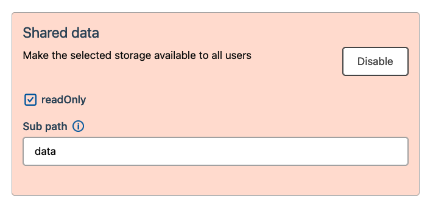

# Configuration
## Sharing data among users
To share data among the users of JupyterHub, when installing or reconfiguring,
start by selecting a volume in the persistent storage field.
Then, navigate to the `Advanced configuration` section and check the `enabled`
checkbox in the `sharedData` subsection.



The shared data is by default not editable by other users, but you can enable
this by unchecking the `readOnly` checkbox. Note that this will allow any
users to add files or edit existing files.

If you want to mount a subfolder in the persistent storage, specify the path
to the subfolder in the `subPath` field. Note that this path is relative to
the root of the persistent storage.

### Sharing access to GPUs
In many cases it is useful to share GPUs among all users. In order to allow users to access GPUs,
[ipyparallel](https://ipyparallel.readthedocs.io/en/latest/) is used.
ipyparallel works by running separate Jupyter kernels on remote nodes.
This enables a user to with very little modification run their notebook on another GPU enabled machine.
To enable ipyparallel, ensure that `enabled` is ticked in the `ipyparallel` section of the `Adavanced configuration`.

To use ipyparallel within a notebook, run the following script inside a notebook
```
import ipyparallel as ipp
import random
rc = ipp.Client()
worker_id = random.randint(0, len(rc.ids)-1)
rc = rc.activate(targets=[worker_id])
```
which will configure the ipyparallel client and select a single node which is used for execution.

You are then able to run all code in a notebook cell by using the `%%px` notebook command. Output will be handled in the same manner as if the code was executed on the local kernel.
Each execution node will mount the same volumes as the notebook, but will run as user with very limited access. It is therefore important to make all files used by the code readable to all users.

So, a cell containing the following code
```
%%px
with open('/home/e19b7304-2d13ec-2d490f-2d9fa0-2de6d6b4c3a858/file.txt') as f:
    print(f.readlines())
```
will be able to read the file stored in the users home directory.

To read more about how to use ipyparallel with Jupyter notebooks, see the following [link](https://ipyparallel.readthedocs.io/en/latest/tutorial/magics.html).
The `%%px` notebook magic also works with regular notebook magic commands, so commands like
```
%%px
!/home/e19b7304-2d13ec-2d490f-2d9fa0-2de6d6b4c3a858/gpu-enabled-binary
```
will work if you need to execute other binaries on a GPU enabled machine.


# Usage
## Accessing the admin panel
Jupyterhub allows you to administer and access the notebooks that are
associated with the Jupyterhub server. This can for instance be useful in
order to help users with debugging, or shutting down notebooks that use a lot
of resources.

To access the admin panel, begin by navigating to the `Control Panel` which
should be in on the right-hand side of the Jupyter navigation bar on the top
of the page.


Then, click on the `Admin` tab in the navigation bar. This tab should be on
the left side of the navigation bar.


You should then be taken to a page which
allows you to add new users, stop, access and edit the notebooks of individual
users, as well as shutting down the Hub.


### How to add new packages
In case you are missing some packages from the default application image, you can add those packages yourself by creating a custom docker image.
See  {ref}`this tutorial <custom-docker-image>`  for generic instructions on how to add packages.

After having read the tutorial above, you can use the dockerfile below as a starting point when creating the dockerfile that adds new packages.
```
# See the value of userImage in
#
#   https://github.com/Uninett/helm-charts/blob/master/repos/stable/jupyterhub/values.yaml
#
# to determine the latest base image

FROM quay.io/uninett/jupyterhub-singleuser:<use latest tag here>

# Install system packages
USER root
RUN apt update && apt install -y vim

# Install other packages
USER notebook
RUN pip install scikit-learn
```
