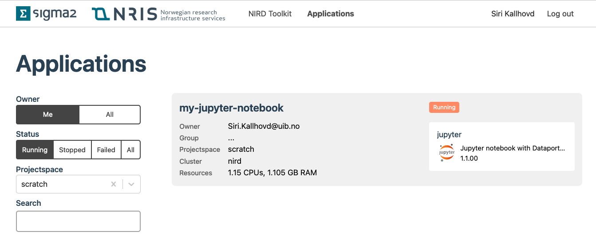
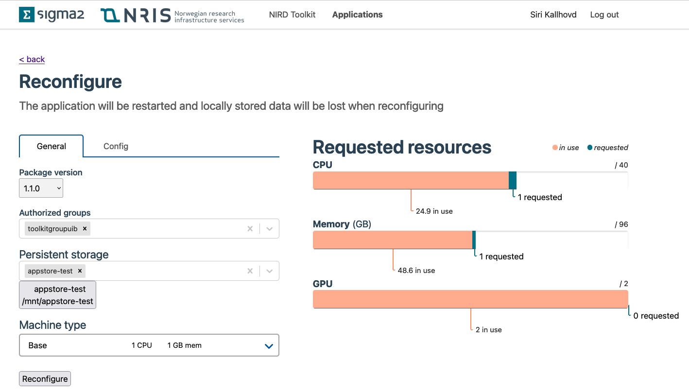
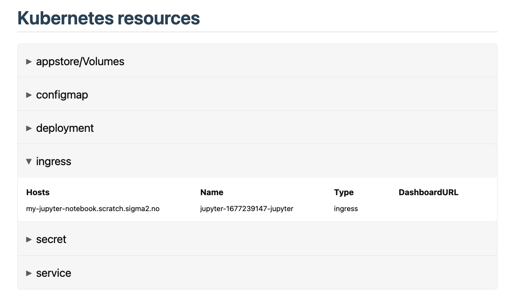

# Application management

## Listing all applications
To list all applications, go to the `My applications` tab in the main navigation menu.

On this page, applications in all projectspaces you have access to is listed.
By default, only applications created by you is shown.
To show all applications within a projectspace, click on the `All` button in
the application filtering bar. In the filtering bar, you will also find
functions for filtering applications based on for instance status,
projectspace or general metadata.

## Viewing the details of a specific application
To view the details of a specific application, click on the name of the application.
You will then be taken to a page containing various information about the
application.

As seen above, the first section of this page contains general information about the
application, such as the URL you can visit in order to use the application,
when it was created, which projectspace it exists in and email of whoever
created the application.

Further down the page you can see notes about this application.
These notes may contain useful information about how to connect to the
application, or use various other features.

Below the application notes, you will find a list of the volumes that are
accessible to various parts of the application.

At the bottom of the page is a list of events. These events show information
about what is currently happening to the application, such as that it
is pulling a Docker image, or mounting a volume.
Most of this information is only useful when the application is initializing or
failing, so most of the time there will be few or none events.

## Upgrading an application to the newest version
Sometimes it may be useful to reconfigure your application after it has been
created. By clicking on the `Reconfigure` tab, you will be navigated to a page
very similar to the installation page, which allows you to change the
configuration of a package. This is for instance useful if a new version of
the package has been released.

Note that the application will be restarted and locally stored data will be
lost when reconfiguring. See the `Installing a package`-page for more details
as to what each field means.

## Starting and stopping an application
If you want to keep the application configuration, but stop using the
resources associated with it, you can stop the application by navigating to
the `Stop` tab. After stopping the application, you can start it again by
going to the `Start` tab. This will reuse your previous configuration.

## Deleting an application
When you are done using your application, you can delete it by going to the
`Delete`-tab. After the application has been deleted, you may for some time be
able to find the application by listing all applications, and then choose
`All` in the status filtering bar.

You can then navigate to the application, and go to the `Configuration` tab in
order to see which configuration the application had when running.

## *Advanced* - Viewing the Kubernetes resources an application is using
To view the Kubernetes resources created by your application, navigate to the
`Resources` tab. This page shows some details about each resource, as well as
linking to the dashboard URL of the different resources (when available).

