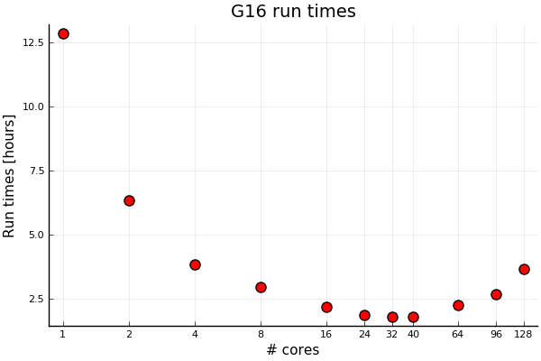
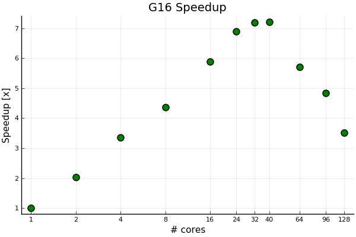

# Gaussian performance tuning using single node shared memory

## Introduction
Gaussian is a widely used and well known application. The current (pt. 2021)
implementation is Gaussian 16. This version can utilise several cores
using an OpenMP threading model and hence confined to a single machine using
shared memory. **The Linda version is not covered on this page**. The local Linda installation
contain some local adaptations, like wraper script etc not present in the
threaded sharred memory version. **A tuning guide for the Linda versions is in preparation**.

This guide is dealing with the shared memory version running on single node.
Gaussian is compiled using the PGI (now NVIDIA) compiler using OpenMP.
For those of you who know OpenMP well, be aware that the PGI compiler only support a
limited set of OpenMP environment flags.

The Gaussian manual describe several options which is important for the performance.
The keywords most associated with parallel execution is
- `%NPROCSHARED=xx`
- `%MEM=yyyyMB`

* `%NPROCSHARED` set how many OpenMP threads Gaussian can launch, as the name
suggest it's shared memory (which implies a single node).
*  `%MEM` set how much memory (often called core) Gaussian can use in total, this include
memory for 2-electron integrals which might be calculated in-core if possible.


There are also environment variables that handle OpenMP and PGI compiler settings.
* `OMP_PROC_BIND` can be tried to improve performance (have been reported to fail with some SLURM jobs,
use with caution).
* `PGI_FASTMATH_CPU` should be set to the architecture used, see later. Some performance improvement.

Recomputing 2-electron integrals, direct SCF is now default as it's faster to
compute these than reading them from disk. In addition doing the calculation
in memory (in-core) is also default (if possible). This can have a major
impact of performance. See later about memory allocation.

Please consult the [Gaussian manual](https://gaussian.com) about specific settings.


## Scaling
Single node shared memory OpenMP is known to have limited scaling in most usage scenarios.
With the current processors it's common to have far more cores available in
each compute node than what Gaussian can effectively utilise. The figure below
show examples of scaling, not all applications scale linearly. Some even run
slower with a high core count.


Hence, care must be taken not to waste cores by requesting too many.
A scaling study should be undertaken and the optimal core count for the input
in question should be established. As Gaussian has a huge number of
different modes and methods clear guidelines cannot be given, only that
Gaussian (using OpenMP) does not scale to high core counts.

It's important to set the same number of cores in `both` the SLURM file and the
Gaussian input file, or at least as many as specified in the Gaussian input.
The Linda version have a wrapper for this, but that is an exception. Please verify
that the number of cores in slurm `--tasks-per-node` and `%NPROCSHARED` are the same.
Gaussian will launch NPROCSHARED threads, if less allocated cores
some threads will share cores with severe performance implications.

Quite common findings is that a relatively small number of cores are
optimal as the scaling is not very good for any higher number of cores.
These extra cores are essential wasted and could be used by other jobs.

Below is an example of a real Gaussian run:





There is a significant speedup with core count from one core and up to
a core count of about 32. Using more than 40 cores seems counterproductive
for shared-memory parallelization. With Linda parallelization, we can go
further.
Even for problems with fairly long run times in the order of hours. It's not
expected that this will change with run times in the order of days as this is
an iterative process.

After about 16 cores the return of applying more cores levels
off. Hence about 16 cores seems like a sweet spot. Running at 128
cores waste 7/8 of the CPU resources. However, there is also the
amount of memory needed to run efficiently to be considered (see next
section).  While cores might be idle when huge amount of memory is
need this is the nature of two limited resources. Both are resources,
but cores have historically been perceived  as the most valuable.

How many cores to use is an open question, most runs are different. A scaling study
should be undertaken at the beginning of a compute campaign. Running at 1,2,4,8 cores etc
and plotting speedup vs cores to find an optimal core count.

## Memory specification
The Gaussian manual states that `"Requests a direct SCF calculation, in
which the two-electron integrals are recomputed as needed"`. This is
the default. In addition it states `"... SCF be performed storing the full
integral list in memory"`. This is done automatically if enough memory is requested,
see Gaussian manual on SCF : [Gaussian manual SCF](https://gaussian.com/scf/) .

The figure below show a dramatic increase in performance at the memory size
where the 2-electron fit in the memory. From 8 to 6 hours (depending on
memory requested) down to less than 3 hours at the memory size where
all the 2-electrons integrals fit in the memory.


The problem is then to find how much memory is needed to fit the integrals in memory, the real gain
in performance is when enough memory is allowed to keep the 2-electron integrals in core.
This require a large amount of memory as seen from the figure above.
Another possibility is to review the `SLURM` log (all SLURM log files emit memory statistice)
and look for maximum resident memory at the end of the log file. When job is running it's possible
to log in to the node the job is running on and run tools like `top` or `htop` and look at
memory usage for your application. See also our page on {ref}`choosing-memory-settings`.

Just requesting far too much memory is a waste of resources.
We advise spending some time to get a handle of this threshold value
for your relevant input and use this a guideline for future runs.

As the number of nodes with large amount of memory is limited it will
always be a trade off between queue time and run time. How much gain
(lower run time) will adding extra memory yield?

The Sigma2 systems have a range of nodes with different amount of
memory, see the {ref}`hardware-overview`.

It might be beneficial to check different nodes and associated
memory capabilities. Both Saga and Fram have Gaussian installed and both systems
have nodes with more memory installed.

Example of SLURM options for a relatively large run on Fram :
```
#SBATCH --partition=bigmem
#SBATCH --time=0-24:0:0
#SBATCH --nodes=1
#SBATCH --tasks-per-node=64
#SBATCH --mem=5600G
```
Requesting 64 cores with a total of 5600 GiB of memory, essential all of the usable
memory available in the Hugemem nodes. All this memory or all these cores might not
yield the optimal performance. Some sweet spot need to be found, some testing should be done
to establish good practice for a compute campaign. As seen from the figure above there is no gain
in using more memory that what's needed to hold the integrals in memory (instead of writing and reading from the disk).

<!-- radovan: commented out below since it seems technical, disconnected to the job -->
<!-- examples, and at least the documented run-time difference seems insignificant -->
<!-- to worry about this -->

<!-- ## Environment variables -->
<!-- Gaussian is compiled using the PGI compilers, which only make use of a -->
<!-- small set of OpenMP environment variables, -->
<!-- [PGI manual 2017](https://www.pgroup.com/resources/docs/17.10/x86/pgi-user-guide/index.htm#openmp-env-vars). -->

<!-- Setting correct environment variables can have significant impact on -->
<!-- performance (the OMP_PROC_BIND=true can be tried, it normally improves performance, but failues have been spotted). -->
<!-- We suggest the following settings as a guideline: -->
<!-- - `export PGI_FASTMATH_CPU=skylake` -->

<!-- The last one can be replaced with avx2, if problems like illegal instruction or operand is encountered. -->
<!-- The figure below show the effect of the CPU settings: -->

<!--  -->

<!-- The effect is about 1%, which is small, but often Gaussian run for days and 1% of a day is about 15 min which is a nice -->
<!-- payoff for just setting a flag, if you run with 32 cores it saves your quota 8 CPU hours on a 24 hrs run (32*24*0.01). -->
