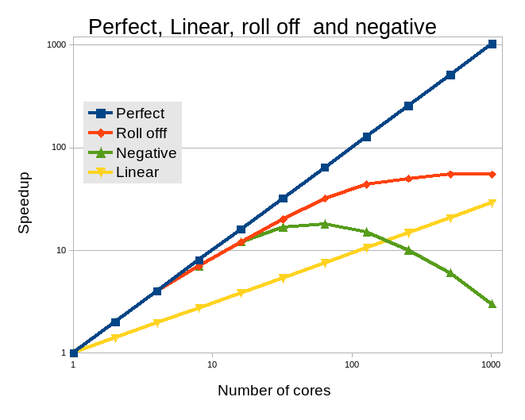
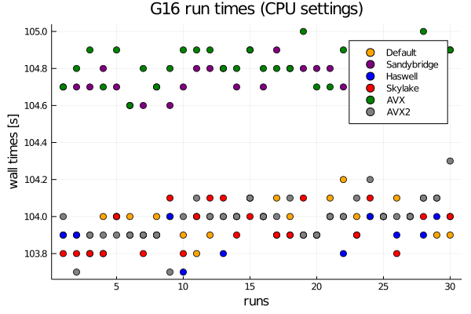

# Gaussian performance tuning

## Introduction
Gaussian is a widely used and well known application. The current
implementation is Gaussian 16. This version can utilise several cores
using OpenMP threading and hence confined to a single machine using
shared memory (a distributed version using LINDA also exist, but not
covered here).

The manual describe several options which is important for the performance.
The keywords most associated with parallel execution is 
- `%NPROCSHARED=xx`
- `%MEM=yyyyMB`

There are also environment variables that handle OpenMP and PGI compiler settings.
- `OMP_PROC_BIND`
- `PGI_FASTMATH_CPU`

Recomputing 2-electron integrals, direct SCF is now default as it's faster to
compute these than reading them from disk. In addition doing the calculation 
in memory (in-core) is also default (if possible). This can have a major
impact of performance. See later about memory allocation. 

Please consult the [Gaussian manual][https://gaussian.com] about specific settings.


## Scaling
OpenMP is known to have limited scaling in most usage scenarios. With
the current processors it's common to have far more cores available in
each compute node than what Gaussian can effectively utilise. The figure below
show examples of scaling, not all applications scale linearly. Some even run
slower with a high core count. 


Hence, care must be taken not to waste cores by requesting too many. 
A scaling study should be undertaken and the optimal core count for the input
in question should be established. As Gaussian has a huge number of
different modes and methods clear guidelines cannot be given, only that 
Gaussian (using OpenMP) does not scale to high core counts. 

It's important to set the same number of cores in `both` the SLURM file and the
Gaussian input file, or at least as many as specified in the Gaussian input. 

Quite common findings is that a relatively small number of cores are
optimal as the scaling is not very good for any higher number of
cores. These extra cores are essential wasted and could be used by other jobs.

Below is an example of a real Gaussian run:


There is a significant speedup with core count from one core and up to
a core count of about 32. Using more than 40 cores seems counterproductive. 
Even for problems with fairly long run times in the order of hours. It's not 
expected that this will change with run times in the order of days as this is 
an iterative process. 

After about 16 cores the return of applying more cores levels
off. Hence about 16 cores seems like a sweet spot. Running at 128
cores waste 7/8 of the CPU resources. However, there is also the
amount of memory needed to run efficiently to be considered (see next
section).  While cores might be idle when huge amount of memory is
need this is the nature of two limited resources. Both are resources,
but cores have historically been perceived  as the most valuable. 

## Memory specification
The Gaussian manual states that `"Requests a direct SCF calculation, in
which the two-electron integrals are recomputed as needed"`. This is
the default. In addition it states `"... SCF be performed storing the full 
integral list in memory"`. This is done automatically if enough memory is requested, 
see Gaussian manual on SCF : ![Gaussian manual SCF][https://gaussian.com/scf/] .

The figure below show a dramatic increase in performance at the memory size
where the 2-electron fit in the memory. From 8 to 6 hours (depending on
memory requested) down to less than 3 hours at the memory size where
all the 2-electrons integrals fit in the memory.


The problem is then to find how much memory is needed to fit it in memory. 
It can be found by trial and error, or it might be calculated from the 
number of basis functions. One might just allocate enough memory, then run `top` or
`htop` on the node running the job and record the maximum resident (RSS) memory. 
Another possibility of to review the `SLURM` log and look for maximum resident memory. 

Just requesting far too much memory is a waste of resources.
We advise spending some time to get a handle of this threshold value
for your relevant input and use this a guideline for future runs.

As the number of nodes with large amount of memory are limited it will
always be a trade off between queue time and run time. How much gain
(lower run time) will adding extra core yield?

The Sigma2 systems have a range of nodes with different amount of
memory, [Sigma2 hardware overview][https://documentation.sigma2.no/hpc_machines/hardware_overview.html].

It might be beneficial to check different nodes and associated
memory capabilities. Both Saga and Fram have Gaussian installed and both systems
have nodes with more memory installed. 

Example of SLURM options for a relatively large run on Fram :
```
#SBATCH --partition=bigmem
#SBATCH --time=0-24:0:0
#SBATCH --nodes=1
#SBATCH --tasks-per-node=64
#SBATCH --mem=5600G
``` 
Requesting 64 cores each with a total of 5600GiB of
memory, essential all of the usable memory available in the Hugemem nodes. All this
memory or all these cores might not yield the optimal
performance. Some sweet spot need to be found for each molecule and
Gaussian functions.

## Environment variables
Gaussian is compiled using the PGI compilers, which only make use of a
small set of OpenMP environment variables.
![PGI manual 2017][https://www.pgroup.com/resources/docs/17.10/x86/pgi-user-guide/index.htm#openmp-env-vars].

Setting correct environment variables can have significant impact on
performance.  We suggest the following settings as a guideline:
- `export OMP_PROC_BIND=true`
- `export PGI_FASTMATH_CPU=skylake`

The last one can be replaced with avx2, if problems like illegal
instruction or operand is encountered. The figure below show the effect of
the CPU settings:



