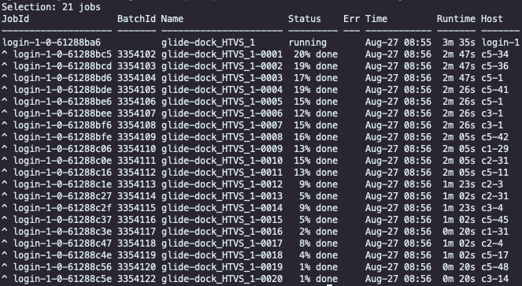

# The Schrödinger job control facility
The job control facility sits on top of the slurm queuing system. Thus, when running Schrodinger jobs, please use
the job control facility to check, cancel or update your jobs. 

## List my jobs
* `$SCHRODINGER/jobcontrol -list`

If you have subjobs, append -c (child of the main job/driver):
* `$SCHRODINGER/jobcontrol -list -c`

This will print something like:

In the above example the driver (main thread) is running on localhost (login-1 in this example) and 20 subjobs on the 
compute nodes on SAGA. Each Schrodinger job gets its own `JobId` that is internally used by the job control facility. 
When using the job control facility, you point to the JobId. The `BatchId` is the normal job id generated by SLURM and
is what you will see in the queue from the command `squeue -u $USER`. The jobcontrol will also display the progress
status of each job (`Status`), errors (`Err`), `Runtime` and compute nodes/Host (`Host`). 

## Cancel my jobs
If you for some reason need to cancel a job completely, you need to kill the main thread (driver). From the print above,
the command would be:
* `$SCHRODINGER/jobcontrol -kill login-1-0-61288ba6`

This will kill the main thread and the subjobs, and also remove them from the slurm queue. 

### List of jobcontrol commands
`$SCHRODINGER/jobcontrol -keyword`

| Keyword      | Description           |
| ------------- |:-------------:| 
 | -list  |list the jobid, job name and status. Use '-children' flag to include subjobs.|
  |-show | show the basic information about the job|
  |-showsys | show system information about the job (pids, ports, etc.)|
  |-dump | display the complete job record|
  |-db <jobdb> | use the given jobdb, rather than ~/.schrodinger/.jobdb2|
  |-reindex | recreate the jobdb index for the current host|
  |-reindexall | recreate the jobdb index for all hosts|
  |-cancel | cancel a job that has been launched, but not started|
  |-kill | stop the job immediately (and recover output files)|
  |-killnooutput | stop the job immediately and abandon output files|
  |-abort | emergency stop, abandon output files and the job record|
  |-stop | ask the job to stop itself as soon as possible (bmin,desmond,multisim only)|
  |-pause | suspend the job temporarily|
  |-resume | continue running a paused job|
  |-monitor <n> | ask for monitoring files to be sent every <n> sec. Specify zero seconds to turn off monitoring|
  |-files | list the files related to the job, with their labels|
  |-view <label> | view the job file with <label>|
  |-update | ask for an update of the job results (bmin only)|
  |-ping | verify that the job is receiving messages|
  |-recover | recover a previous job that did not complete successfully|
  |-recover_jobrecord | recover jobrecord of given job(s).|
  |-delete | remove job from the database, if completed. Use '-force' flag to delete uncompleted jobs (dangerous)|
  |-wait | wait until job finishes|
  |-int <seconds> . interval for checking job status (default is 5 sec)|
  |-v[ersion] | display program version and exit|
  |-h[elp] | display this help message| | 

The flags can be one or more of:

| additional flags     | Description           |
| ------------- |:-------------:| 
  |-c[hildren] | include the children of the selected jobs (for the 'list' action, list all subjobs individually)|
  |-noc[hildren] | don't include the children of the selected jobs (for the 'list' action, don't include subjob summaries)|
  |-m[issing] | include jobs with missing job records (for which only auxiliary files are present)|
  |-d[ebug] | show debug information when performing this action even if running in nondebug mode|
  |-n[odebug] | do not show debug information, even if running in debug mode|
  |-f[orce] | see 'delete' action above|

### Go to:
* [Schrodinger main page](schrodinger.md)
* [Using the Schrodinger suite](schrodinger_usage.md)
* [Setting up the Hosts file](schrodinger_hosts.md)
* [Hosts file keywords](host_file_settings.md)
* [Job control facility](job_control.md)